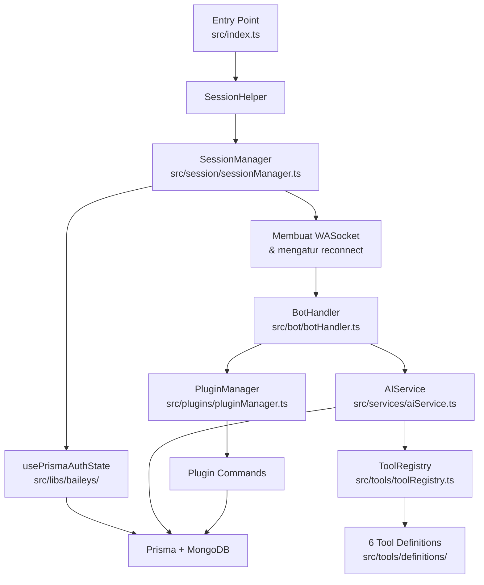
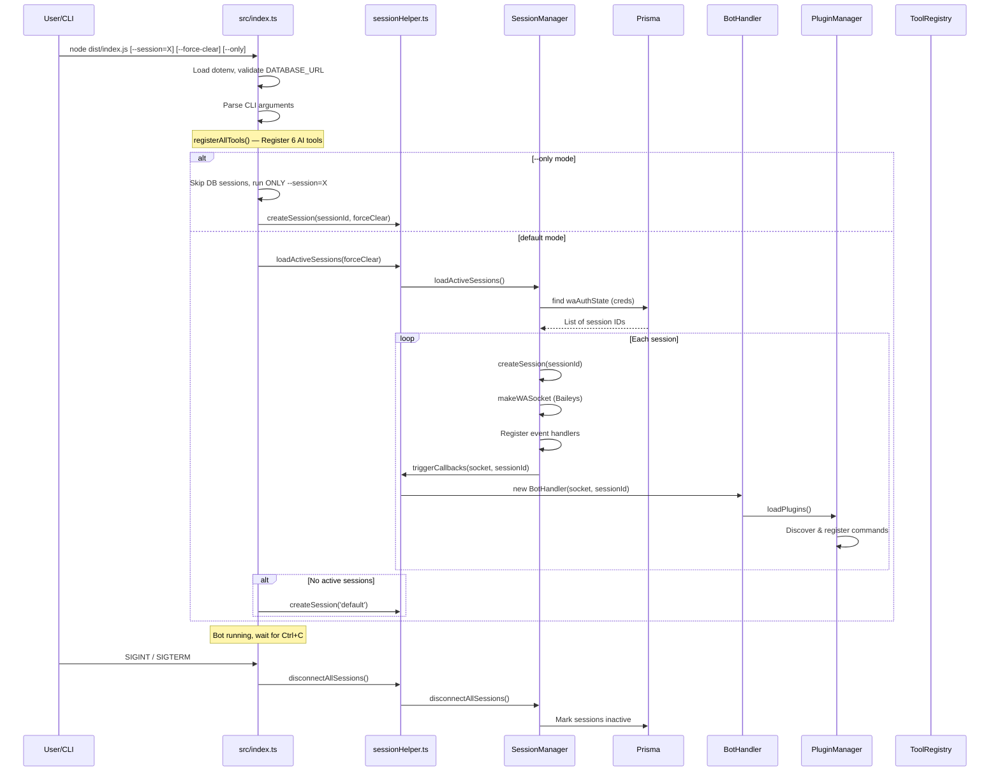
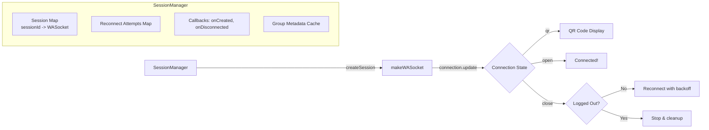
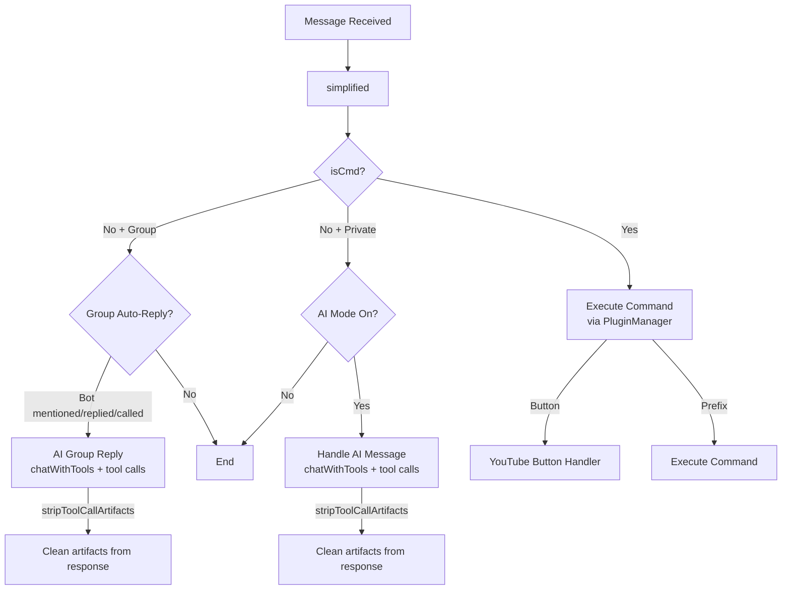
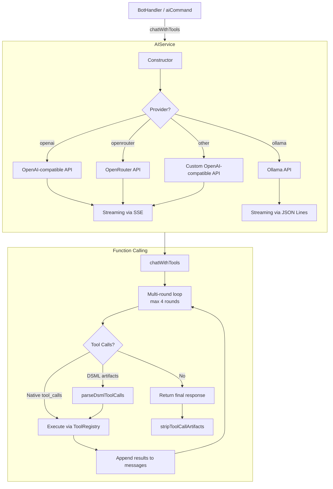
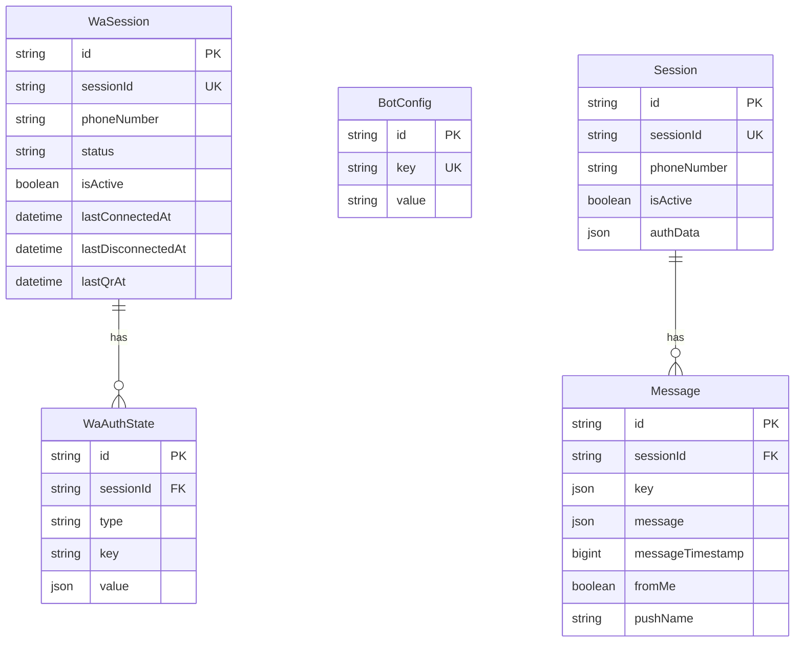
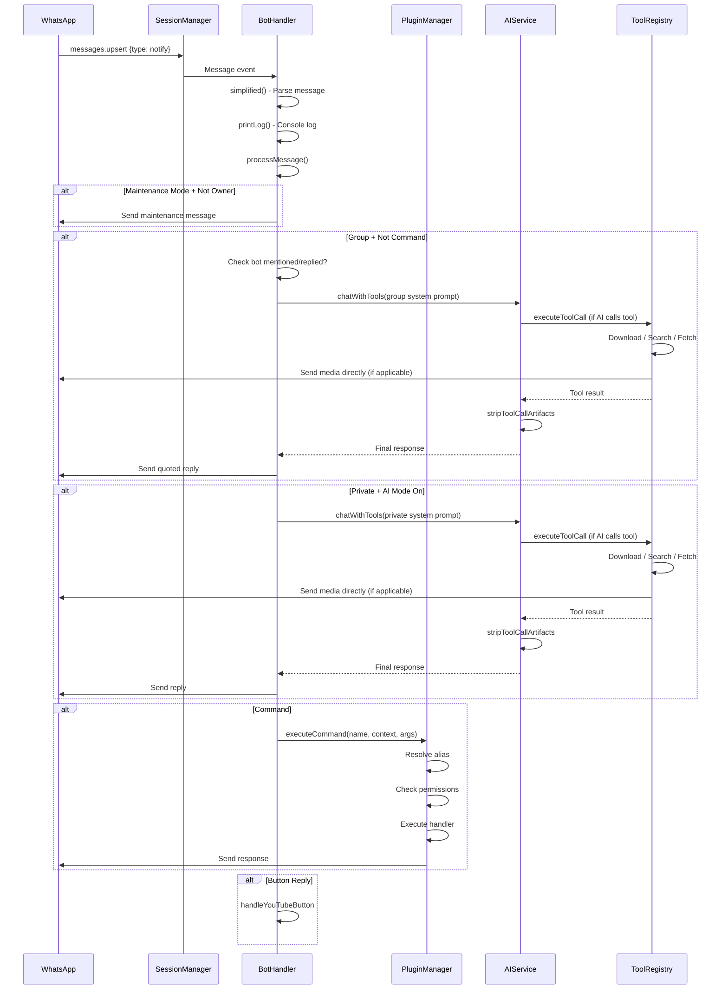
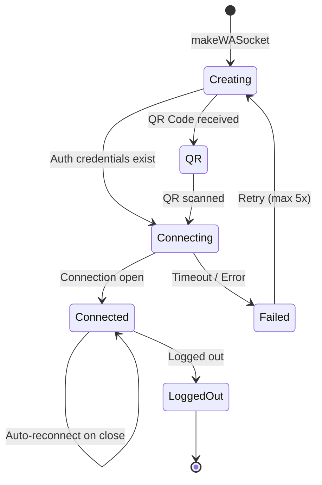
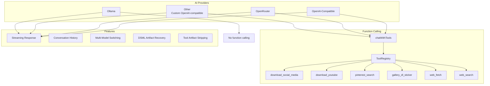
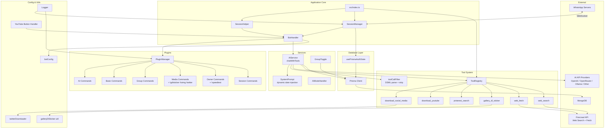

# Bot-Baileys-AI — Dokumentasi Arsitektur Sistem

> **Versi:** 1.1.0  
> **Deskripsi:** Multi-session WhatsApp bot menggunakan Baileys, Prisma, dan MongoDB  
> **Bahasa:** TypeScript (ESM)

---

## Daftar Isi

1. [Tujuan & Konsep Dasar](#1-tujuan--konsep-dasar)
2. [Struktur Direktori](#2-struktur-direktori)
3. [Alur Startup](#3-alur-startup)
4. [Layer Arsitektur](#4-layer-arsitektur)
   - [4.1 Entry Point](#41-entry-point)
   - [4.2 Session Layer](#42-session-layer)
   - [4.3 Bot Layer](#43-bot-layer)
   - [4.4 Plugin System](#44-plugin-system)
   - [4.5 Service Layer](#45-service-layer)
   - [4.6 Database Layer](#46-database-layer)
   - [4.7 Configuration Layer](#47-configuration-layer)
   - [4.8 Tool System](#48-tool-system)
   - [4.9 Utility Layer](#49-utility-layer)
5. [Alur Pesan](#5-alur-pesan)
6. [Sistem Plugin](#6-sistem-plugin)
7. [Multi-Session & Reconnect](#7-multi-session--reconnect)
8. [AI Integration](#8-ai-integration)
9. [Database Schema](#9-database-schema)
10. [Deployment](#10-deployment)
11. [Environment Variables](#11-environment-variables)

---

## 1. Tujuan & Konsep Dasar

Bot ini adalah **WhatsApp bot multi-session** yang memungkinkan:

- Menjalankan **banyak nomor WhatsApp** dalam satu instance Node.js
- Setiap session memiliki koneksi WebSocket sendiri ke WhatsApp
- **Plugin architecture** yang memisahkan command berdasarkan kategori
- **AI Chat** dengan dukungan multi-provider (OpenAI, OpenRouter, Ollama, Other)
- **AI function calling** — 6 tools untuk download media, search, fetch
- **Auto-download** media sosial (TikTok, Instagram, Facebook, Twitter/X, YouTube)
- **Group management** dan fitur group AI
- **Persistent auth state** di MongoDB via Prisma
- **gallery-dl sticker maker** — buat stiker dari URL atau keyword pencarian

**Arsitektur mengikuti pola berlapis** yang terdiri dari:



---

## 2. Struktur Direktori

```
Bot-Baileys-AI/
├── prisma/
│   └── schema.prisma              # Database schema (MongoDB)
│
├── scripts/
│   └── migrateAuthState.ts        # Migration script
│
├── src/
│   ├── index.ts                   # Entry point
│   │
│   ├── bot/
│   │   ├── botHandler.ts          # Core message processor
│   │   └── autoDownload.ts        # Social Media auto-download
│   │
│   ├── config/
│   │   └── botConfig.ts           # Configuration loader
│   │
│   ├── database/
│   │   └── prisma.ts              # Prisma client singleton
│   │
│   ├── libs/
│   │   └── baileys/
│   │       └── usePrismaAuthState.ts  # Baileys auth persistence
│   │
│   ├── plugins/
│   │   ├── pluginManager.ts       # Plugin loader & dispatcher
│   │   ├── README.md
│   │   ├── ai/
│   │   │   └── aiCommand.ts       # AI command (!ai)
│   │   ├── basic/
│   │   │   ├── changelog.ts       # !changelog
│   │   │   ├── help.ts            # !help / !menu
│   │   │   ├── ping.ts            # !ping
│   │   │   ├── reportbug.ts       # !reportbug
│   │   │   ├── status.ts          # !status
│   │   │   └── testbutton.ts      # !testbutton
│   │   ├── group/
│   │   │   ├── hidetag.ts         # !hidetag
│   │   │   ├── setgroup.ts        # !setgroup
│   │   │   └── togglebot.ts       # !togglebot
│   │   ├── media/
│   │   │   ├── facebook.ts        # !facebook
│   │   │   ├── galleryDlSticker.ts # !gdlsticker
│   │   │   ├── instagram.ts       # !instagram
│   │   │   ├── pinterest.ts       # !pinterest
│   │   │   ├── sticker.ts         # !sticker
│   │   │   ├── stickerToImage.ts  # !toimg
│   │   │   ├── tiktok.ts          # !tiktok / !tt
│   │   │   ├── twitter.ts         # !twitter
│   │   │   └── youtube.ts         # !youtube
│   │   ├── owner/
│   │   │   ├── eval.ts            # !eval
│   │   │   ├── exec.ts            # !exec
│   │   │   ├── speedtest.ts       # !speedtest
│   │   │   └── test_owner.ts      # Owner test
│   │   └── session/
│   │       ├── create_session.ts       # !create_session
│   │       ├── disconnect_session.ts   # !disconnect
│   │       └── list_sessions.ts        # !listsessions
│   │
│   ├── services/
│   │   ├── aiService.ts           # AI provider abstraction + function calling
│   │   ├── systemPrompt.ts        # System prompts (private + group) with dynamic date
│   │   ├── aiModeHandler.ts       # AI mode handler
│   │   └── groupToggle.ts         # Group AI toggle
│   │
│   ├── session/
│   │   ├── sessionManager.ts      # Singleton: session lifecycle
│   │   ├── sessionHelper.ts       # Bridge: session + bot handler
│   │   └── authStateDB.ts         # (deprecated/optional)
│   │
│   ├── tools/
│   │   ├── index.ts               # registerAllTools() barrel
│   │   ├── toolRegistry.ts        # Central tool registry singleton
│   │   └── definitions/
│   │       ├── index.ts           # Registers all 6 tools
│   │       ├── socialDownload.ts  # Unified: IG, TikTok, FB, Twitter
│   │       ├── downloadYoutube.ts # YouTube downloader
│   │       ├── pinterestSearch.ts # Pinterest image search
│   │       ├── galleryDlSticker.ts # gallery-dl sticker creation
│   │       ├── webFetch.ts        # Firecrawl web scraper
│   │       └── webSearch.ts       # Firecrawl web search
│   │
│   ├── types/
│   │   ├── index.ts               # Re-export
│   │   ├── command.ts             # CommandContext, CommandConfig, dll
│   │   ├── plugin.ts              # Plugin, PluginModule, CategoryPlugin
│   │   ├── tools.ts               # AIToolDefinition, ToolContext, etc.
│   │   └── nexo-aio-downloader.d.ts  # Type declarations
│   │
│   └── utils/
│       ├── galleryDlSticker.ts    # gallery-dl process + sticker creation
│       ├── logger.ts              # Logging utility
│       ├── pinterest.ts           # Pinterest helper
│       ├── toolCallFilter.ts      # DSML parsing, artifact detection/stripping
│       ├── twitterDownloader.ts   # yt-dlp based Twitter/X download
│       └── youtubeButtonHandler.ts # YouTube button handler
│
├── config.json                    # Opsional: bot config file
├── .env.example                   # Environment variables template
├── package.json
├── tsconfig.json
├── prisma.config.ts
├── Dockerfile
└── pnpm-workspace.yaml
```

---

## 3. Alur Startup



---

## 4. Layer Arsitektur

### 4.1 Entry Point

**File:** [`src/index.ts`](src/index.ts:1)

Bertanggung jawab untuk:
- Memuat environment variables via `dotenv`
- Memvalidasi koneksi database
- Memproses CLI arguments (`--session`, `--force-clear`, `--only`)
- **Register semua AI tools** via `registerAllTools()` sebelum session dimulai
- Memuat session aktif dari database atau membuat session baru
- Menangani graceful shutdown (SIGINT/SIGTERM)

**CLI Arguments:**
| Argument | Deskripsi |
|----------|-----------|
| `--session=<id>` | Buat/replace session dengan ID tertentu |
| `--force-clear` | Hapus auth data session yang ada |
| `--only` | Hanya jalankan session dari `--session`, skip session DB lain |

### 4.2 Session Layer

**File:** [`src/session/sessionManager.ts`](src/session/sessionManager.ts:26) | [`src/session/sessionHelper.ts`](src/session/sessionHelper.ts:1)

#### SessionManager (Singleton)

Class utama yang mengelola lifecycle session WhatsApp:



**Fitur utama:**
- **Auto-reconnect:** Exponential backoff (1s, 2s, 4s, 8s, 16s, max 30s) hingga 5 kali percobaan
- **Session callbacks:** `onSessionCreated()` dan `onSessionDisconnected()` untuk integrasi BotHandler
- **QR Code:** Ditampilkan di terminal via `qrcode-terminal`
- **Session filtering:** Environment variables `INCLUDE_SESSIONS` / `EXCLUDE_SESSIONS`
- **Persistence:** Session metadata disimpan ke `WaSession` model di MongoDB

#### SessionHelper (Bridge)

**File:** [`src/session/sessionHelper.ts`](src/session/sessionHelper.ts:1)

Menjembatani SessionManager dengan BotHandler:
- Mendaftarkan callback `onSessionCreated` → membuat BotHandler baru
- Mendaftarkan callback `onSessionDisconnected` → cleanup BotHandler
- Menyediakan public API: `createSession()`, `getSession()`, `getAllSessions()`, `disconnectSession()`, `disconnectAllSessions()`, `loadActiveSessions()`

### 4.3 Bot Layer

**File:** [`src/bot/botHandler.ts`](src/bot/botHandler.ts:35)

#### BotHandler

Class utama pemroses pesan. Menerima event dari `messages.upsert` dan memprosesnya.

**Fungsi `simplified()`** mengubah raw `WAMessage` dari Baileys menjadi objek yang lebih mudah digunakan, mengekstrak:
- Metadata pesan (from, fromMe, isGroup, type, dll)
- Teks pesan dan command parsing
- Prefix detection
- Button/Interactive message detection
- Type checks (isImage, isVideo, isAudio, dll)
- Quoted message info

**Fungsi `processMessage()`** — routing logika utama:



**Fitur yang ditangani:**
1. **Maintenance mode** — tolak command non-owner saat maintenance
2. **Group auto-reply** — AI merespon ketika bot di-mention, di-reply, atau dipanggil; menggunakan `chatWithTools()` dengan group system prompt
3. **AI mode** — Percakapan AI di private chat; menggunakan `chatWithTools()` dengan private system prompt
4. **Button replies** — Handle interactive button responses (YouTube)
5. **Command execution** — via PluginManager
6. **Tool call artifact filtering** — `stripToolCallArtifacts()` diaplikasikan ke semua respons AI

### 4.4 Plugin System

**File:** [`src/plugins/pluginManager.ts`](src/plugins/pluginManager.ts:13)

#### Arsitektur Plugin

```mermaid
flowchart LR
    subgraph PluginManager
        PM[PluginManager] --> |loadPlugins| Scan[Scan plugins directory]
        
        Scan --> |.ts file| Legacy[Legacy Plugin]
        Scan --> |folder| Category[Category Plugin]
        
        Legacy --> |export default| LP{PluginModule?}
        LP --> |Yes| Register[Register plugin & commands]
        
        Category --> |index.ts| CI[Load from index]
        Category --> |no index.ts| AD[Auto-discover .ts files]
        
        AD --> CM{CommandModule?}
        CM --> |Yes| Register
        
        Register --> Map[commandMap: Map<br/>name -> {plugin, config, handler}]
        Register --> Alias[aliasMap: Map<br/>alias -> commandName]
    end
    
    subgraph Execution
        E[executeCommand] --> Find{Find in commandMap}
        Find --> |Not found| AliasResolve{Resolve alias}
        AliasResolve --> |Found| Perm[Check permissions]
        
        Perm --> |ownerOnly| O{Is Owner?}
        Perm --> |adminOnly| A{Is Admin?}
        Perm --> |groupOnly| G{Is Group?}
        Perm --> |privateOnly| P{Is Private?}
        
        O --> |No| Reject[Reject]
        A --> |No| Reject
        G --> |No| Reject
        P --> |No| Reject
        
        O --> |Yes| Exec[Execute handler]
        A --> |Yes| Exec
        G --> |Yes| Exec
        P --> |Yes| Exec
    end
```

#### Format Plugin

**Legacy Plugin (PluginModule):**
```typescript
export default {
  name: 'myPlugin',
  version: '1.0.0',
  description: 'Plugin saya',
  commands: [
    { name: 'mycmd', description: '...', usage: '...', category: '...' }
  ],
  handlers: {
    mycmd: async (context, args) => { ... }
  },
  onLoad() { ... },
  onUnload() { ... },
};
```

**Category Plugin (CommandModule per file):**
```typescript
// src/plugins/media/tiktok.ts
export default {
  config: { name: 'tiktok', ... },
  handler: async (context, args) => { ... },
};
```

#### Permission System

PluginManager mengecek permission berdasarkan field di `CommandConfig`:
- `ownerOnly` — hanya nomor owner yang tercantum di config
- `adminOnly` — hanya admin grup (atau owner)
- `groupOnly` — hanya bisa digunakan di grup
- `privateOnly` — hanya bisa digunakan di private chat

#### CommandContext

Setiap handler menerima [`CommandContext`](src/types/command.ts:4):
```typescript
interface CommandContext {
  socket: WASocket;          // Koneksi WebSocket aktif
  sessionId: string;         // ID session saat ini
  fromJid: string;           // JID pengirim
  fromMe: boolean;           // Dari bot sendiri?
  pushName?: string;         // Nama pengirim
  messageTimestamp?: number; // Timestamp pesan
  message: WAMessage;        // Raw Baileys message
  simplified?: SimplifiedMessage; // Simplified message object
  pluginManager?: any;       // PluginManager instance
}
```

### 4.5 Service Layer

#### AI Service

**File:** [`src/services/aiService.ts`](src/services/aiService.ts:30)

Singleton yang menyediakan abstraksi AI multi-provider dengan function calling:



**Provider Configuration:**
| Provider | API Key | Base URL | Model Default |
|----------|---------|----------|---------------|
| openai | `OPENAI_API_KEY` | `OPENAI_BASE_URL` | `gpt-4o-mini` |
| openrouter | `OPENROUTER_API_KEY` | `OPENROUTER_BASE_URL` | `anthropic/claude-3-haiku` |
| ollama | - | `OLLAMA_BASE_URL` | `llama3.2` |
| other | `OTHER_API_KEY` | `OTHER_BASE_URL` | `OTHER_MODEL` |

**Function Calling:**
- `chatWithTools()` — Multi-round execution loop, mendukung native `tool_calls` dan DSML artifact recovery
- Semua provider non-Ollama menerima tools array
- Ollama: fallback ke chat biasa tanpa tools
- Tool artifacts otomatis di-strip dari respons akhir via `stripToolCallArtifacts()`

#### System Prompt

**File:** [`src/services/systemPrompt.ts`](src/services/systemPrompt.ts:16)

System prompts di-extract ke file terpisah dengan dynamic date/time injection:
- `getSystemPrompt()` — Untuk private AI chat
- `getGroupSystemPrompt(time, pushName)` — Untuk group auto-reply
- Inject `Date.now().toLocaleDateString('id-ID')` untuk real-time awareness
- Anti-year-bias instruction: _"JANGAN PERNAH nambahin tahun ke query search"_
- Group prompt: personality chameleon, anti-rambling, time roasting, banter, slang control, greeting rules, toxic handling, tool usage instructions lengkap

#### AI Mode Handler

**File:** [`src/services/aiModeHandler.ts`](src/services/aiModeHandler.ts:33)

Menyediakan mode AI chat (toggle `on`/`off`) per user dengan:
- Context history management
- Max history 20 messages
- Single atau chat mode

#### Group Toggle

**File:** [`src/services/groupToggle.ts`](src/services/groupToggle.ts:1)

Mengelola pengaturan AI per grup. Disabled groups disimpan di MongoDB via model `BotConfig`.

### 4.6 Database Layer

**File:** [`src/database/prisma.ts`](src/database/prisma.ts:1) | [`prisma/schema.prisma`](prisma/schema.prisma:1)

**Database:** MongoDB via Prisma ORM

**Models:**



**Auth State Persistence:**

[`usePrismaAuthState`](src/libs/baileys/usePrismaAuthState.ts:67) mengimplementasikan interface `AuthenticationState` Baileys untuk menyimpan credential dan key di MongoDB:
- `creds` disimpan sebagai satu baris dengan type=`creds`, key=`creds`
- `keys` disimpan per-item dengan type=`<keyType>`, key=`<id>`
- Compound unique constraint pada `(sessionId, type, key)` untuk upsert

### 4.7 Configuration Layer

**File:** [`src/config/botConfig.ts`](src/config/botConfig.ts:1)

Priority loading: `config.json` > Environment Variables > Default Values

| Config | File | Env | Default |
|--------|------|-----|---------|
| Owner Numbers | `ownerNumbers` | `OWNER_NUMBERS` | `[]` |
| Prefixes | `prefixes` | `PREFIXES` | `['!']` |
| Maintenance | `maintenance` | `MAINTENANCE` | `false` |
| Maintenance Message | `maintenanceMessage` | `MAINTENANCE_MESSAGE` | "🔧 Bot sedang..." |

### 4.8 Tool System

**Directory:** [`src/tools/`](src/tools/)

Sistem tool/AI function calling yang terintegrasi dengan `aiService.ts`.

#### ToolRegistry

**File:** [`src/tools/toolRegistry.ts`](src/tools/toolRegistry.ts:7)

Singleton yang mengelola registrasi dan eksekusi tools:

| Method | Description |
|--------|-------------|
| `register(name, definition, execute)` | Daftarkan tool baru |
| `registerAll(tools)` | Batch register tools |
| `getApiDefinitions()` | Dapatkan array definisi tool untuk OpenAI API |
| `executeToolCall(toolCall, context)` | Eksekusi satu tool call |
| `executeToolCalls(toolCalls, context)` | Eksekusi multiple tool calls |

#### Tool Definitions (6 tools)

**File:** [`src/tools/definitions/index.ts`](src/tools/definitions/index.ts:1)

| Tool | File | Description | Key Params |
|------|------|-------------|------------|
| `download_social_media` | [`socialDownload.ts`](src/tools/definitions/socialDownload.ts) | Download dari Instagram, TikTok, Facebook, Twitter/X | `url` (required) |
| `download_youtube` | [`downloadYoutube.ts`](src/tools/definitions/downloadYoutube.ts) | Download YouTube video/audio | `url`, `format` (video/audio), `quality`, `as_document` |
| `pinterest_search` | [`pinterestSearch.ts`](src/tools/definitions/pinterestSearch.ts) | Cari gambar dari Pinterest | `query` (required) |
| `gallery_dl_sticker` | [`galleryDlSticker.ts`](src/tools/definitions/galleryDlSticker.ts) | Buat stiker dari URL/keyword via gallery-dl | `url` or `query`, `pack`, `author`, `sticker_type`, `index` |
| `web_fetch` | [`webFetch.ts`](src/tools/definitions/webFetch.ts) | Scrape web page via Firecrawl | `url` (required), `maxChars`, `formats` |
| `web_search` | [`webSearch.ts`](src/tools/definitions/webSearch.ts) | Search web via Firecrawl | `query` (required), `maxResults` |

#### Tool Utilities

| File | Purpose |
|------|---------|
| [`src/utils/toolCallFilter.ts`](src/utils/toolCallFilter.ts) | DSML/XML parsing, tool call artifact detection & stripping |
| [`src/utils/twitterDownloader.ts`](src/utils/twitterDownloader.ts) | Twitter/X download via yt-dlp |
| [`src/utils/galleryDlSticker.ts`](src/utils/galleryDlSticker.ts) | gallery-dl process execution + sticker creation via wa-sticker-formatter |

### 4.9 Utility Layer

- **Logger** ([`src/utils/logger.ts`](src/utils/logger.ts:1)): Simple logger dengan level (silent, error, warn, info, debug) dan emoji support
- **YouTube Button Handler** ([`src/utils/youtubeButtonHandler.ts`](src/utils/youtubeButtonHandler.ts)): Handle interactive button untuk YouTube download
- **Pinterest Helper** ([`src/utils/pinterest.ts`](src/utils/pinterest.ts)): Pinterest download utility (cheerio-based)
- **gallery-dl Sticker** ([`src/utils/galleryDlSticker.ts`](src/utils/galleryDlSticker.ts)): Buat stiker WhatsApp dari gallery-dl
- **Twitter Downloader** ([`src/utils/twitterDownloader.ts`](src/utils/twitterDownloader.ts)): Twitter/X media download via yt-dlp
- **Tool Call Filter** ([`src/utils/toolCallFilter.ts`](src/utils/toolCallFilter.ts)): DSML parsing dan artifact filtering

---

## 5. Alur Pesan

Flow lengkap dari pesan masuk hingga response:



---

## 6. Sistem Plugin

### Discovery & Loading

PluginManager melakukan **auto-discovery** dari direktori `src/plugins/`:

1. **File langsung** (`.ts`/`.js`) di root plugins → Legacy Plugin (PluginModule)
2. **Folder** di root plugins → Category Plugin:
   - Jika ada `index.ts` → load sebagai CategoryPlugin
   - Jika tidak ada → auto-discover semua file `.ts` dalam folder sebagai CommandModule

### Command Registration

Setiap command didaftarkan ke:
- `commandMap`: `Map<commandName, { plugin, config, handler }>`
- `aliasMap`: `Map<alias, commandName>`

### Plugin Categories

| Category | Path | Commands |
|----------|------|----------|
| `ai` | `src/plugins/ai/` | `!ai` |
| `basic` | `src/plugins/basic/` | `!changelog`, `!help`, `!ping`, `!reportbug`, `!status`, `!testbutton` |
| `group` | `src/plugins/group/` | `!hidetag`, `!setgroup`, `!togglebot` |
| `media` | `src/plugins/media/` | `!facebook`, `!gdlsticker`, `!instagram`, `!pinterest`, `!sticker`, `!toimg`, `!tiktok`, `!twitter`, `!youtube` |
| `owner` | `src/plugins/owner/` | `!eval`, `!exec`, `!speedtest`, (owner test) |
| `session` | `src/plugins/session/` | `!create_session`, `!disconnect`, `!listsessions` |

---

## 7. Multi-Session & Reconnect

### Session Lifecycle



### Reconnection Logic

Di [`SessionManager.registerMessageHandlers()`](src/session/sessionManager.ts:147):

1. Koneksi terputus (`connection === 'close'`)
2. Cek apakah `loggedOut`
3. Jika tidak logged out → reconnect dengan exponential backoff
4. Max 5 attempts, delay: 1s → 2s → 4s → 8s → 16s (max 30s)
5. Jika max attempts tercapai → session dihapus

### Graceful Shutdown

```typescript
// src/index.ts
process.on('SIGINT', async () => {
  await disconnectAllSessions(); // socket.end() - tanpa logout
  await prisma.$disconnect();
  process.exit(0);
});
```

`disconnectAllSessions()` menggunakan `socket.end()` (bukan `socket.logout()`) agar auth data tetap tersimpan untuk sesi berikutnya.

---

## 8. AI Integration

### Provider Support



### AI Chat Flow

1. **Command Mode** (`!ai <question>`): Single question → `chatWithTools()` → streaming response via AI
2. **Toggle Mode** (`!ai on`): Semua pesan di private chat otomatis direspon AI via `chatWithTools()`
3. **Group Auto-Reply**: Bot di-mention/di-reply/dipanggil → `chatWithTools()` dengan group prompt

### Function Calling Flow

1. User mengirim pesan yang membutuhkan tool (e.g., "download video IG ini")
2. `chatWithTools()` mengirim pesan + tools array ke AI API
3. AI memutuskan tool mana yang dipanggil + parameters
4. AI mengembalikan `tool_calls` (native API) atau DSML artifacts (recovery)
5. `executeToolCall()` menjalankan tool → media dikirim langsung ke user via socket
6. Hasil tool dikembalikan ke AI untuk response akhir
7. Maksimal 4 round tool execution
8. `stripToolCallArtifacts()` membersihkan artifacts dari response akhir

### System Prompts

**File:** [`src/services/systemPrompt.ts`](src/services/systemPrompt.ts:16)

- **Private AI:** Friendly, helpful, tidak membantu coding
- **Group AI:** Casual, pake bahasa Indonesia gaul, personality chameleon, strict time awareness, anti-robotic
- **Dynamic date/time:** `Date.now().toLocaleDateString('id-ID')` di-inject setiap request
- **Anti-year-bias:** Instruksi eksplisit untuk tidak menambah tahun ke query search
- **Group prompt features:** Anti-rambling, time roasting, banter, slang control, greeting rules, toxic handling, tool usage instructions lengkap

### DSML Tool Call Recovery

Untuk model AI yang tidak mendukung native `tool_calls`, sistem DSML (Directive System Markup Language) memungkinkan model memanggil tool melalui format XML-like dalam teks:

```
<鄽 download_social_media>
鄽鄽url: "https://instagram.com/p/xyz"
</鄽 download_social_media>
```

`parseDsmlToolCalls()` menggunakan whitelist nama tool yang terdaftar untuk mencegah prompt injection.

### Tool Call Artifact Filter

`stripToolCallArtifacts()` membersihkan residual artifacts dari respons AI:
- DSML tags
- JSON function call blocks
- Raw XML tool call markup

### Conversation History

- Disimpan per `sessionId` (user JID untuk private, group JID untuk grup)
- Grup: expiry 10 menit
- Command `!ai clear` untuk menghapus history

---

## 9. Database Schema

### Model: WaSession

Menyimpan metadata session WhatsApp. Terpisah dari auth state.

| Field | Type | Description |
|-------|------|-------------|
| `sessionId` | String (unique) | ID session |
| `phoneNumber` | String? | Nomor telepon |
| `status` | String | `disconnected`, `qr`, `connected`, `logged_out` |
| `isActive` | Boolean | Status aktif |
| `lastConnectedAt` | DateTime? | Terakhir connect |
| `lastDisconnectedAt` | DateTime? | Terakhir disconnect |
| `lastQrAt` | DateTime? | Terakhir QR code |

### Model: WaAuthState

Menyimpan Baileys auth credentials dan keys.

| Field | Type | Description |
|-------|------|-------------|
| `sessionId` | String | FK ke WaSession |
| `type` | String | `creds` atau tipe key Baileys |
| `key` | String | Key identifier |
| `value` | Json | Value (via BufferJSON) |

**Unique:** `(sessionId, type, key)` — memungkinkan upsert.

### Model: BotConfig

Simple key-value store untuk konfigurasi dinamis.

| Field | Type | Description |
|-------|------|-------------|
| `key` | String (unique) | Key (e.g., `ai_group_disabled:jid`) |
| `value` | String | Value |

### Model: Session & Message

Legacy models (sudah ada tapi tidak aktif digunakan untuk message storage).

---

## 10. Deployment

### Docker

**File:** [`Dockerfile`](Dockerfile:1)

Multi-stage build:
1. **Builder stage** (`node:24-bookworm`): Install dependencies, build TypeScript
2. **Runtime stage** (`node:24-bookworm-slim`): Hanya runtime dependencies + compiled output

**Runtime dependencies:** `python3`, `libvips`, `openssl`, `ffmpeg`, `tini`

**Environment defaults:**
- `NODE_ENV=production`
- `EXCLUDE_SESSIONS=dev` (skip dev session di production)

### Docker Compose (recommended)

```yaml
version: '3.8'
services:
  mongodb:
    image: mongo:7
    volumes:
      - mongo_data:/data/db
  
  bot:
    build: .
    env_file: .env
    depends_on:
      - mongodb
    environment:
      - DATABASE_URL=mongodb://mongodb:27017/bot_baileys
    # Override untuk development:
    # command: npm run start:dev
    # environment:
    #   - EXCLUDE_SESSIONS=
```

---

## 11. Environment Variables

| Variable | Required | Description |
|----------|----------|-------------|
| `DATABASE_URL` | **Yes** | MongoDB connection string |
| `OWNER_NUMBERS` | No | Owner WhatsApp numbers (comma-separated) |
| `PREFIXES` | No | Command prefixes (default: `!`) |
| `AI_PROVIDER` | No | `openai`, `openrouter`, `ollama`, or `other` |
| `OPENAI_BASE_URL` | No | OpenAI-compatible API URL |
| `OPENAI_API_KEY` | No | OpenAI API key |
| `OPENAI_MODEL` | No | Model name |
| `OPENROUTER_API_KEY` | No | OpenRouter API key |
| `OPENROUTER_BASE_URL` | No | OpenRouter base URL |
| `OPENROUTER_MODEL` | No | OpenRouter model |
| `OLLAMA_BASE_URL` | No | Ollama server URL |
| `OLLAMA_MODEL` | No | Ollama model |
| `OTHER_API_KEY` | No | API key untuk provider 'other' |
| `OTHER_BASE_URL` | No | Base URL untuk provider 'other' |
| `OTHER_MODEL` | No | Model untuk provider 'other' |
| `FIRECRAWL_URL` | No | Firecrawl API URL (default: `https://api.firecrawl.dev`) |
| `GALLERY_DL_BIN` | No | Path ke binary gallery-dl |
| `GALLERY_DL_TIMEOUT_MS` | No | Timeout untuk gallery-dl (default: 60000) |
| `GALLERY_DL_SEARCH_TEMPLATE` | No | URL template untuk search gallery-dl |
| `GALLERY_DL_COOKIES` | No | File cookies untuk gallery-dl |
| `INCLUDE_SESSIONS` | No | Session IDs to load (comma-separated) |
| `EXCLUDE_SESSIONS` | No | Session IDs to skip (comma-separated) |
| `LOG_LEVEL` | No | Log level: `silent`, `error`, `warn`, `info`, `debug` |
| `NODE_ENV` | No | `development` or `production`. Di `production`: trace HTTP satu-baris tidak dicetak — bersih di terminal maupun viewer web (`GET /api/logs`); baris `HttpLog` tetap ditulis untuk access log |
| `MAINTENANCE` | No | Enable maintenance mode (`true`) |
| `MAINTENANCE_MESSAGE` | No | Custom maintenance message |

---

## Diagram Arsitektur Lengkap



---

> **Dokumentasi ini dibuat pada:** 17 Juni 2026  
> **Dokumentasi ini diupdate pada:** 25 Juni 2026
> **Versi:** 1.1.0  
> **Maintainer:** Tim Bot-Baileys-AI
